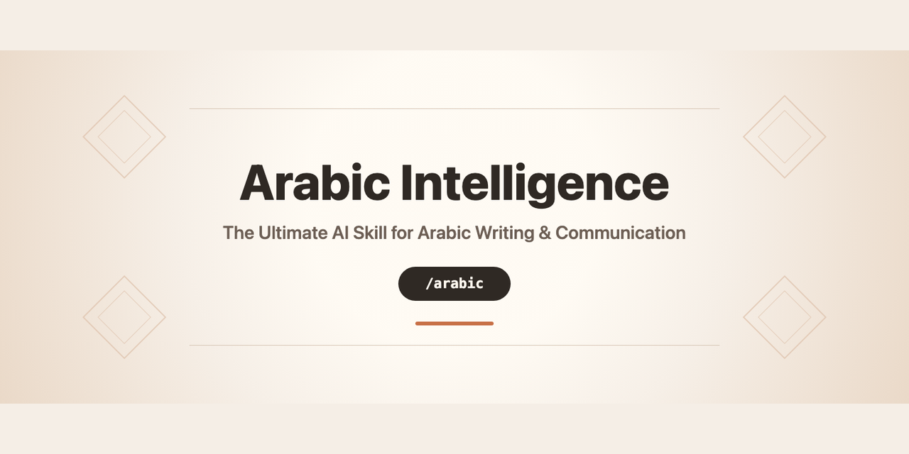

# Awesome Arabic Skill

<p align="center">
  
</p>

<p align="center">
  <a href="https://github.com/mediabubble-adv/arabic-skill/releases"></a>
  <a href="./docs/README.md"></a>
  <a href="./docs/supported/README.md"></a>
  
  
</p>

**Awesome Arabic Skill** (`arabic`) is a MediaBubble skill for Arabic content creation, strategy, research distillation, and review. It is designed to behave like a senior Arabic content partner inside AI coding tools: it reads context, clarifies intent, recommends a direction, writes, humanizes, and audits before delivery.

It is **not** a translation shortcut. Current version is `1.0.0`, the first public release.

<p align="center">
  
  
  
  
  
  
  
  
</p>

```text
user asks -> guide -> clarify -> recommend -> write -> review
```

## What It Does

| Capability | Current role |
|------------|------------------------|
| Arabic content creation | Captions, ads, landing pages, blogs, scripts, sales copy, books, UI microcopy, and professional documents |
| Dialect routing | Masri-first, pan-Arab capable, with 11 dialect modules |
| Humanization | Removes translationese, AI phrasing, stiff rhythm, and wrong register |
| Project awareness | `/arabic auto` scans project files so the skill can explain a product, tool, or codebase in natural Arabic |
| Research intelligence | Combines internet research, official sources, and `reference/` packs before distilling updates into runtime files |
| Command system | `/arabic` with subcommands for guide, write, audit, coach, plan, research, voice, auto, and help |
| Website dogfooding | v1.1.0 will test the skill by creating an Arabic-first multi-page install and tutorial website |

## Install

### Cursor

```bash
git clone https://github.com/mediabubble-adv/arabic-skill.git
cd arabic-skill
cp -r arabic ~/.cursor/skills/arabic
```

See [Cursor support](./docs/supported/cursor/README.md).

### Claude Code / Claude Desktop

```bash
git clone https://github.com/mediabubble-adv/arabic-skill.git
cd arabic-skill
cp -r arabic ~/.claude/skills/arabic
```

See [Claude support](./docs/supported/claude/README.md).

### Other tools

See the [supported tools index](./docs/supported/README.md). The repo currently documents 22 AI coding surfaces. Website and `npx skills add` distribution are deferred to `v1.1.0`.

## Supported Tool Assets

The repository includes local logo assets under [`public/assets/`](./public/assets/) for README, docs, and the future install website. GitHub renders these relative paths directly in Markdown, so docs can use either Markdown images or HTML `` tags when fixed icon sizing is needed.

<p>
  
  
  
  
  
  
  
  
  
  
  
  
</p>

## Usage Examples

Natural language works:

```text
Write 5 Masri Instagram captions for a fitness app launch in Cairo.
```

```text
Audit this Arabic landing page. It sounds translated and too formal.
```

```text
Scan this project and explain what it does in human Arabic for non-technical users.
```

The command surface makes the same workflows faster:

```text
/arabic guide
/arabic write meta --dialect masri --brief .arabic/briefs/fitness-launch.yaml
/arabic audit --file content/landing-ar.md
/arabic coach --file prompt.txt
/arabic plan website --dialect masri
/arabic research meta-ads
/arabic auto
```

## `/arabic` Command Model

The product direction is one root command, not dozens of independent skills:

| Command | Purpose |
|---------|---------|
| `/arabic` or `/arabic guide` | Advisory flow for unclear ideas |
| `/arabic write <type>` | Pro mode for complete briefs |
| `/arabic audit` | Arabic copy review and scoring |
| `/arabic coach` | Arabic prompt improvement |
| `/arabic plan <project>` | Websites, campaigns, books, and brand systems |
| `/arabic research <topic>` | Structured research collection and distillation |
| `/arabic voice` | Brand voice save, load, and show |
| `/arabic auto` | Workspace-aware inference from project files |
| `/arabic help` | Copy-ready usage reference |

Full spec: [Command Surface](./docs/planning/command-surface.md).

## Project-Aware Arabic Content

A core capability is making the skill useful inside real repositories and product folders. The workspace scanner rules inspect files such as `README.md`, docs, routes, package metadata, examples, and product copy, then produce Arabic content that explains the project in clear human language.

Expected outputs include:

- Arabic product summaries for non-technical users
- Arabic install and usage tutorials
- Arabic landing-page copy based on actual project capabilities
- Arabic README sections, changelogs, release notes, and help pages
- Dialect-aware explanations for tools, apps, APIs, and SaaS products

This behavior is routed through `/arabic auto`, Project Mode, Dev-Tech domain support, and the runtime project-context scanner.

## Repository Structure

```text
arabic-skill/
├── arabic/                 # Runtime skill pack users install
│   ├── SKILL.md            # Master router, name: arabic
│   ├── dialects/           # 11 dialect modules
│   ├── domains/            # 12 industry packs
│   ├── conversations/      # Sales, support, negotiation, coaching, podcast, community
│   ├── professional-docs/  # Contracts, AI skills, agent rules, compliance language
│   └── references/         # Engines, intake, templates, humanization, QA support
├── reference/              # 38 canonical specialist packs, kept as source material
├── docs/                   # Product, planning, analysis, engineering, supported tools
├── scripts/                # Validation scripts
├── VERSION                 # Current product version
└── CHANGELOG.md
```

Runtime install folder is `arabic/`. The GitHub repo can stay `mediabubble-adv/arabic-skill`.

## Development Status

| Area | Status |
|------|--------|
| Runtime baseline | `arabic/` pack released at `v1.0.0` |
| Canonical references | 38 packs preserved in `reference/` |
| Planning docs | Active, with roadmap and release governance for future phases |
| `/arabic` command system | Runtime router and Cursor adapter shipped |
| Research layer | Specified for structured research collection and future runtime expansion |
| Website | Deferred to `v1.1.0` as a dogfood test project |
| Public release | `v1.0.0` tagged and released after runtime validation |

## Documentation

| Doc | Purpose |
|-----|---------|
| [Docs Index](./docs/README.md) | Full documentation map |
| [PRD](./docs/product/prd.md) | Product vision and success criteria |
| [Roadmap](./docs/planning/roadmap.md) | Release train and phase sequence |
| [Implementation Plan](./docs/planning/implementation-plan.md) | File-by-file build plan |
| [Claude Plan Audit Prompt](./docs/planning/claude-plan-audit-prompt.md) | Prompt for Claude to audit and rewrite the plan set |
| [Research Intelligence Plan](./docs/planning/research-intelligence-plan.md) | Internet + AI + reference research workflow |
| [Command Surface](./docs/planning/command-surface.md) | `/arabic` grammar and subcommands |
| [Reference Distillation](./docs/planning/reference-distillation.md) | How `reference/` becomes runtime behavior |
| [Supported Tools](./docs/supported/README.md) | Install profiles for AI tools |

## Validation

```bash
./scripts/validate-skill.sh
./scripts/validate-docs.sh
```

## Release Policy

- `0.1.x` means development.
- `v1.0.0` is the first public release and the current tagged release.
- `v1.1.0` is for the Arabic-first tutorial website and distribution layer.
- Future release tags should only be created after the documented gates pass.

See [Versioning and Releases](./docs/engineering/versioning-and-releases.md).

## Positioning

> **Awesome Arabic Skill**: Masri-first, pan-Arab capable. A skill that helps you think, brief, plan, write, explain, and audit Arabic content.

## License

MIT. See [LICENSE](./LICENSE).

<p align="center">
  <sub>Built for the Arab world by MediaBubble · 2026</sub>
</p>
