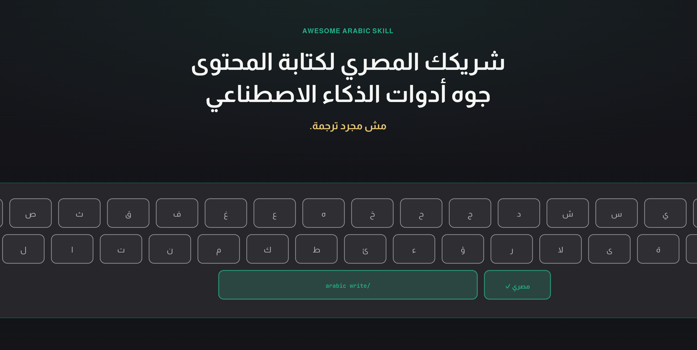
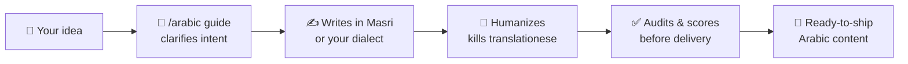

<div align="center">

<a href="https://arabic-skill.vercel.app">
  
</a>

# Awesome Arabic Skill

**Your senior Arabic content partner inside AI coding tools.**
Masri-first, pan-Arab capable — it thinks, briefs, writes, humanizes, and audits. *Not a translation shortcut.*

[](https://www.npmjs.com/package/@mediabubble-adv/arabic-skill)
[](https://www.npmjs.com/package/@mediabubble-adv/arabic-skill)
[](./LICENSE)
[](./docs/supported/README.md)
[](./arabic/dialects/)
[](https://arabic-skill.vercel.app)

**[🌐 Website](https://arabic-skill.vercel.app)** · **[⚡ Quick Start](#-quick-start)** · **[🧰 Supported Tools](#-works-with-your-ai-tool)** · **[📚 Docs](./docs/README.md)** · **[💬 Discord](https://discord.gg/cjhhJFF5N)**

</div>

---

## 😤 The Problem

Ask any AI tool to write Arabic and you get the same thing: **stiff MSA that sounds translated from English**. Wrong register, robotic rhythm, zero dialect awareness. Your Egyptian audience can smell it from the first line.

**Awesome Arabic Skill fixes that.** It turns Cursor, Claude Code, Codex, and 20+ other tools into a native Arabic content team — one that reads your project, clarifies your intent, recommends a direction, writes in real Masri (or 10 other dialects), then audits its own output before delivery.



---

## ⚡ Quick Start

From zero to your first Masri caption in **under 2 minutes**.

### 1️⃣ Install

**Cursor** (recommended — installs the skill, `/arabic` command, and routing rule):

```bash
npx @mediabubble-adv/arabic-skill@latest install --target cursor
```

**Claude Code / Codex:**

```bash
npx @mediabubble-adv/arabic-skill@latest install --target claude
npx @mediabubble-adv/arabic-skill@latest install --target codex
```

**Or via the open [skills.sh](https://skills.sh) registry** (skill pack only):

```bash
npx skills add mediabubble-adv/arabic-skill -a cursor -g -y
```

> 🌐 Prefer a guided setup? The **[install website](https://arabic-skill.vercel.app)** walks you through every tool, in Masri, with copy-ready commands.

### 2️⃣ Say hello

Open your AI tool and run:

```text
/arabic guide
```

The skill introduces itself, asks what you're making, and recommends a direction. No setup, no config files — it's advisory from the first message.

### 3️⃣ Write something real

```text
/arabic write caption --dialect masri --count 3
```

Or just talk to it naturally:

```text
Write 5 Masri Instagram captions for a fitness app launch in Cairo.
```

```text
Audit this Arabic landing page. It sounds translated and too formal.
```

```text
Scan this project and explain what it does in human Arabic for non-technical users.
```

### 4️⃣ Level up (optional)

Working inside a client repo? Scaffold a workspace so briefs, voice, and plans persist:

```text
/arabic init
```

That's it. You now have a full Arabic content department in your editor. 🎉

---

## 🎯 What It Does

| Capability | What you get |
| --- | --- |
| ✍️ **Content creation** | Captions, ads, landing pages, blogs, scripts, sales copy, books, UI microcopy, professional docs |
| 🗺️ **Dialect routing** | Masri-first with **11 dialect modules** + 4 regional SEO-AEO markets (Gulf, KSA, Levantine) |
| 🧹 **Humanization** | Strips translationese, AI phrasing, stiff rhythm, and wrong register |
| 🔎 **Project awareness** | `/arabic auto` scans your repo and explains your product in natural Arabic |
| 🧠 **Research intelligence** | `research/` layer with a 4-state lifecycle + `/arabic research <topic>` |
| 📦 **Load presets** | 11 named task bundles — plan, write, audit, seasonal, campaign, book, coach, and more |
| ↔️ **RTL & dialect audit** | Runtime validation for bidirectional text + MSA-bleed detection |
| 🎙️ **Brand voice** | Save, load, and reuse your brand voice across sessions with `/arabic voice` |

## ⌨️ The `/arabic` Command

One root command, a full content team behind it:

| Command | Purpose |
| --- | --- |
| `/arabic` or `/arabic guide` | Advisory flow for unclear ideas |
| `/arabic write <type>` | Pro mode for complete briefs |
| `/arabic audit` | Arabic copy review and scoring |
| `/arabic coach` | Improve your Arabic prompts |
| `/arabic plan <project>` | Websites, campaigns, books, brand systems |
| `/arabic research <topic>` | Structured research collection and distillation |
| `/arabic init` | Scaffold `.arabic/` workspace in a client repo |
| `/arabic voice` | Brand voice save / load / show |
| `/arabic auto` | Workspace-aware inference from project files |
| `/arabic help` | Copy-ready usage reference |

Full grammar: [Command Surface](./docs/planning/command-surface.md)

---

## 🧰 Works With Your AI Tool

**24 supported tools.** One-command `npx` presets for Cursor, Claude, and Codex — documented manual paths for everything else:

```bash
npx @mediabubble-adv/arabic-skill@latest install --list      # see all 24 targets
npx @mediabubble-adv/arabic-skill@latest install --target all # install every global preset
```

<details>
<summary><b>📋 Full tool matrix (click to expand)</b></summary>

<br/>

| Tool | Fit | Install | Profile |
| --- | --- | --- | --- |
| Aider | Strong | manual | [Profile](./docs/supported/aider/README.md) |
| Amp | Strong | manual | [Profile](./docs/supported/amp/README.md) |
| Antigravity | Partial | manual | [Profile](./docs/supported/antigravity/README.md) |
| ChatGPT | Partial | manual | [Profile](./docs/supported/chatgpt/README.md) |
| Claude | Strong | `npx --target claude` | [Profile](./docs/supported/claude/README.md) |
| Cline | Strong | manual | [Profile](./docs/supported/cline/README.md) |
| Codex | Strong | `npx --target codex` | [Profile](./docs/supported/codex/README.md) |
| Continue | Partial | manual | [Profile](./docs/supported/continue/README.md) |
| Copilot | Partial | manual | [Profile](./docs/supported/copilot/README.md) |
| Cursor | Strong | `npx --target cursor` | [Profile](./docs/supported/cursor/README.md) |
| Gemini | Partial | manual | [Profile](./docs/supported/gemini/README.md) |
| Hermes Agent | Partial | manual | [Profile](./docs/supported/hermes-agent/README.md) |
| JetBrains Junie | Partial | manual | [Profile](./docs/supported/jetbrains-junie/README.md) |
| Kilo Code | Partial | manual | [Profile](./docs/supported/kilo-code/README.md) |
| Kiro | Partial | manual | [Profile](./docs/supported/kiro/README.md) |
| OpenClaw | Partial | manual | [Profile](./docs/supported/openclaw/README.md) |
| OpenCode | Partial | manual | [Profile](./docs/supported/opencode/README.md) |
| OpenHands | Strong | manual | [Profile](./docs/supported/openhands/README.md) |
| Qwen | Limited | manual | [Profile](./docs/supported/qwen/README.md) |
| Replit Agent | Partial | manual | [Profile](./docs/supported/replit/README.md) |
| Sourcegraph Cody | Partial | manual | [Profile](./docs/supported/sourcegraph-cody/README.md) |
| VS Code | Partial | manual | [Profile](./docs/supported/vs-code/README.md) |
| Windsurf | Strong | manual | [Profile](./docs/supported/windsurf/README.md) |
| Zed | Strong | manual | [Profile](./docs/supported/zed/README.md) |

Fit tiers and packaging notes: [Support Matrix](./docs/supported/support-matrix.md). Tools without an `npx` preset use manual copy paths documented in each profile (or `npx … install --dir <skills-path>`).

</details>

> 💡 **Tip:** installing from a git clone? Plain `npx` resolves the local package and fails — use `@latest` as shown, or `npm run install:cursor`, or `node bin/arabic-skill.js install --target cursor`.

---

## 🌐 The Website

The **[Awesome Arabic Skill website](https://arabic-skill.vercel.app)** is the fastest way to explore the project — and it's dogfooded: every page is written **by the skill, in Masri**, so you can judge the output quality before you install anything.

<div align="center">

**[👉 arabic-skill.vercel.app — see it write, then install it](https://arabic-skill.vercel.app)**

</div>

- 🧭 Guided install for all 24 tools with copy-ready commands
- 🇪🇬 Full Masri RTL experience — the product demoing itself
- 📖 `/about` page written and audited by the skill

---

## 🏗️ How It's Built

<details>
<summary><b>Repository structure</b></summary>

```text
arabic-skill/
├── arabic/                 # Runtime skill pack users install
│   ├── SKILL.md            # Master router, name: arabic
│   ├── dialects/           # 11 dialect modules
│   ├── domains/            # 12 industry packs
│   ├── conversations/      # Sales, support, negotiation, coaching, podcast, community
│   ├── professional-docs/  # Contracts, AI skills, agent rules, compliance language
│   ├── references/         # Engines, intake, templates, humanization, QA support
│   └── templates/.arabic/  # Onboarding scaffold (config, briefs, README)
├── research/               # Collected intelligence, citation registry, distillation queue
├── reference/              # 38 canonical specialist packs, kept as source material
├── docs/                   # Product, planning, analysis, engineering, supported tools
├── website/                # Next.js marketing site (live on Vercel)
├── tests/golden/           # Golden fixtures (G1–G18, R*, RQ*) + scenario manifest
├── scripts/                # Validation scripts (npm run validate)
├── bin/arabic-skill.js     # npx installer CLI
├── VERSION                 # Current product version
└── CHANGELOG.md
```

</details>

<details>
<summary><b>Development status — v1.2.9, Maintenance Mode 🛡️</b></summary>

<br/>

**Maintenance Mode active** as of 2026-07-07 (Phase 9A complete). Support SLA: 48–72h on issues.

| Area | Status |
| --- | --- |
| Runtime pack | `arabic/` at `v1.2.9` — runtime hardening (load presets, RTL/dialect audit, research distillation) |
| Canonical references | 63 files in `arabic/references/` + `research/` knowledge base |
| Research layer | **R0–R4 ✅** — `research/`, `/arabic research`, 4-state lifecycle, monthly snapshot automation |
| RTL & dialect audit | **P8B ✅** — `validate-rtl.sh`, `validate-dialect-bleed.sh`, MSA-bleed detection |
| Load presets | **P8A ✅** — 11 named task bundles + 4 regional SEO-AEO |
| `/arabic` commands | Shipped — router, Cursor adapter, init, auto, research, guide, write, audit, coach, plan, voice |
| Website | **v1.1.0 ✅** — [arabic-skill.vercel.app](https://arabic-skill.vercel.app) (8 Masri routes, Playwright tested) |
| npm distribution | `@mediabubble-adv/arabic-skill@1.2.9` — 24 tool profiles, npx install + publish CI |
| Golden tests | **21 golden tests ✅** — G1–G12 (behavioral), G13–G18 (website), P8A–P8C (hardening) |
| Community | Discord, GitHub Discussions, Substack newsletter, metrics dashboards |
| Next phase | **Phase 9B (optional)** — Slack bot, webhooks, custom templates • OR sustain v1.2.9 |

**Release history:** `v1.0.0` first public release (P1–P6, G1–G12) → `v1.1.x` website + npm publish → `v1.2.x` full Cursor npx install, skills.sh, research R0–R4, validation stack. Future tags only after documented gates pass. See [Versioning and Releases](./docs/engineering/versioning-and-releases.md).

</details>

<details>
<summary><b>Validation & quality gates</b></summary>

<br/>

```bash
npm run validate
```

Runs skill reference integrity, frontmatter schema, docs links, supported-tool parity, website install copy (G14), npm pack contents, Cursor install dry-run, research scaffold + stale-source checks, onboarding templates, golden fixture structure, **G1–G12 routing contracts**, and **G1–G12 scenario manifest** parity.

Individual gates:

```bash
./scripts/validate-skill.sh
./scripts/validate-frontmatter.sh
./scripts/validate-docs.sh
./scripts/validate-research.sh
./scripts/validate-reference-sync.sh
./scripts/validate-onboarding.sh
./scripts/validate-golden.sh
./scripts/validate-behavioral-golden.sh
./scripts/validate-golden-scenarios.sh
./scripts/validate-website-playwright.sh
npm run golden:harness -- --list
npm run golden:harness -- --run --dry-run
npm run golden:harness -- --run --report auto
```

Website UX: `npm run validate:website-playwright` (CI `website-e2e`). Opt-in LLM runs: `npm run golden:harness` (not in default CI).

</details>

## 📚 Documentation

| Doc | Purpose |
| --- | --- |
| [Docs Index](./docs/README.md) | Full documentation map |
| [PRD](./docs/product/prd.md) | Product vision and success criteria |
| [Command Surface](./docs/planning/command-surface.md) | `/arabic` grammar and subcommands |
| [Supported Tools](./docs/supported/README.md) | 24 tool profiles with install instructions |
| [Project Status](./docs/PROJECT_STATUS.md) | Complete phase timeline, validation gates |
| [Maintenance Mode Plan](./docs/MAINTENANCE_MODE.md) | Support cadence, SLAs, metrics targets |
| [Roadmap](./docs/planning/roadmap.md) | Release train and phase sequence |
| [Metrics Dashboard](./docs/metrics/) | Weekly reports, marketplace tracker, GA4 analytics |

## 💬 Community & Support

- **[Discord](https://discord.gg/cjhhJFF5N)** — real-time chat, #help channel, feature voting
- **[GitHub Discussions](https://github.com/mediabubble-adv/arabic-skill/discussions)** — questions, ideas, announcements
- **[Substack Newsletter](https://arabic-skill.substack.com)** — release notes, metrics reports, tips
- **[GitHub Issues](https://github.com/mediabubble-adv/arabic-skill/issues)** — bugs and feature requests (48–72h response)

---

<div align="center">

### Ready to write Arabic that actually sounds Arabic?

```bash
npx @mediabubble-adv/arabic-skill@latest install --target cursor
```

**[🌐 Explore the website](https://arabic-skill.vercel.app)** · **[⭐ Star this repo](https://github.com/mediabubble-adv/arabic-skill)** · **[💬 Join Discord](https://discord.gg/cjhhJFF5N)**

MIT © [MediaBubble](./LICENSE) · Built for the Arab world · 2026

</div>
