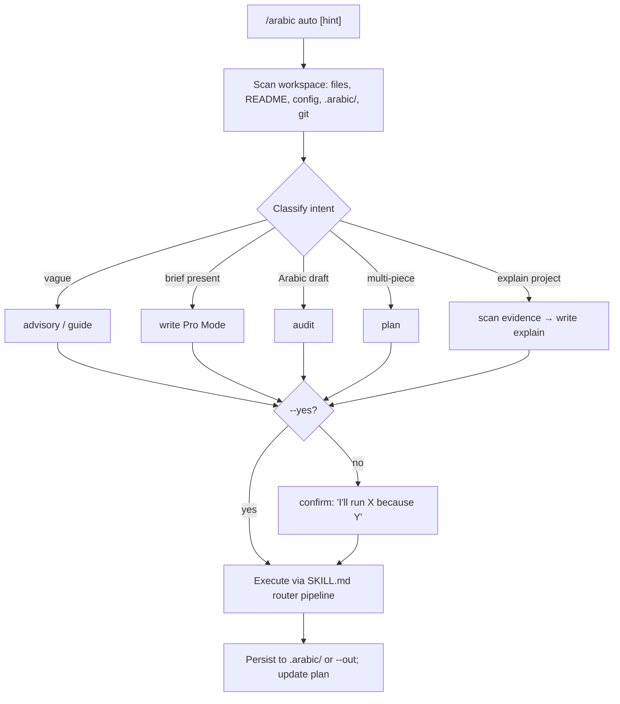

# Command Surface — `/arabic`

> One powerful root command with subcommands that route to the full skill — content, marketing, ads, social, books, video scripts, audit, research, and **workspace automation**.

**Status:** Planning (spec now → implement at v1.0.0 in skill + Cursor adapter)  
**Primary invocation:** `/arabic <subcommand> [args]`  
**Fallback:** Natural language still works; commands are the **fast path** for power users.

---

## 1. Design Principles

| Principle | Implementation |
|-----------|----------------|
| **One entry point** | Single root: `/arabic` — never 38 separate slash commands |
| **Subcommands = routers** | Each subcommand locks dialect, workspace, engine, template |
| **Advisory by default** | Bare `/arabic` or `/arabic guide` → guide → clarify → recommend → write → review |
| **Pro when brief is ready** | `/arabic write ...` compresses intake |
| **Workspace-aware** | `/arabic auto` reads project context and acts |
| **File-native** | Outputs can land in repo paths (`.arabic/`, `content/`) |
| **Honest bounds** | No fake APIs; research/ads use preloaded knowledge |

---

## 2. Command Tree (overview)

```text
/arabic                          → advisory mode (default flow)
/arabic guide                    → same as default
/arabic write <type> [opts]      → pro mode: generate deliverable
/arabic audit [file|text]        → review existing Arabic copy
/arabic coach [prompt]           → prompt engineering / repair
/arabic plan <project>           → project mode (website | campaign | book)
/arabic research <topic>         → research intelligence run
/arabic voice [save|load|show]   → brand voice persistence
/arabic auto [task hint]         → workspace automation (scan, infer, execute)
/arabic help [subcommand]        → copy-ready usage
```

---

## 2a. Flag Reference

Flags are global unless noted; `--` long form is canonical.

| Flag | Value | Default | Applies to | Behavior |
|------|-------|---------|------------|----------|
| `--dialect` | `masri`, `khaliji`, `levantine`, … | inferred / ask | all write/plan | Locks dialect file; overrides inference |
| `--platform` | `meta`, `google`, `tiktok`, `snap`, `linkedin`, `instagram`, … | inferred | write | Selects platform rules from ads matrix |
| `--brief` | path to `.yaml`/`.md` | — | write/plan | Loads structured brief → Pro Mode, compresses intake |
| `--file` | path | — | audit/coach | Reads input from a workspace file instead of paste |
| `--out` | path | stdout / `.arabic/` | write/plan/audit | Writes deliverable to a repo path |
| `--yes` | (boolean) | false | auto/plan | Skips the one-line confirmation; runs inferred action |
| `--count` | integer | engine default | write captions/ads | Number of variants to produce |

Unknown flags → warn and ignore (do not fail the command); list valid flags for that verb.

## 3. Write Subcommands (content creation)

Format: `/arabic write <type> [--dialect masri] [--platform meta] [--brief path]`

| Subcommand | Maps to workspace | Engine | Template | Loads |
|------------|-------------------|--------|----------|-------|
| `caption` | Social Creator | Captions | A | `engines.md`, dialect, `taboos.md` |
| `captions` | Social Creator | Captions | A | (batch — 3 tiers × 4 variants) |
| `reel` | Social Creator | Captions + Video | A/C | platform rules in ads matrix |
| `story` | Social Creator | Captions | A | short-form rules |
| `post` | Social Creator / Blogger | Captions or SEO | A/B | by `--platform` |
| `ad` | Ad Agency | Marketing Funnel | A | `ads-service-matrix.md` |
| `ads` | Ad Agency | Marketing Funnel | A | multi-format set |
| `meta` | Performance Marketer | Marketing Funnel | A | Meta-specific matrix row |
| `google` | Performance Marketer | Marketing Funnel | A | Search + RSA patterns |
| `tiktok` | Performance Marketer | Captions + Video | A/C | hook-first script |
| `snap` | Performance Marketer | Captions | A | Snap specs |
| `linkedin` | B2B / Ad Agency | Marketing Funnel | B | professional register |
| `whatsapp` | Sales Professional | Sales Content | A | sequence templates |
| `email` | Sales Professional | Sales Content | B | subject + body |
| `landing` | Website Owner | Website + SEO | B | hero + sections |
| `page` | Website Owner | Website Content | B | full page copy |
| `website` | Website Owner | Website Content | B | triggers **plan** if multi-page |
| `blog` | Blogger / SEO | SEO + AEO | B | `seo-aeo-masri.md` |
| `seo` | Blogger / SEO | SEO Engine | B | keyword-aware |
| `aeo` | Blogger / SEO | AEO Engine | B | FAQ / answer blocks |
| `video` | Video Creator | Video Script | C | two-column script |
| `script` | Video Creator | Video Script | C | alias for video |
| `youtube` | Video Creator | Video Script | C | retention hooks |
| `podcast` | Video Creator | Video Script | C | `conversations/interview-podcast.md` |
| `sales` | Sales Professional | Sales Content | B/C | funnel stage aware |
| `funnel` | Ad Agency | Marketing Funnel | B | staged assets |
| `tagline` | Brand Builder | Brand Voice | A | 12 variants |
| `brand` | Brand Builder | Brand Voice | D | voice guide |
| `book` | Author | Book Engine | E | triggers **plan book** if large |
| `chapter` | Author | Book Engine | E | continuity check |
| `outline` | Author | Book Engine | E | premise + structure |
| `ui` | Indie Dev | UI Microcopy | A | strings + empty states |
| `readme` | Indie Dev / SaaS | Dev-Tech Content | B | project scan + README structure |
| `tutorial` | Indie Dev / SaaS | Dev-Tech Content | B/C | project scan + step-by-step teaching |
| `explain` | Indie Dev / SaaS | Dev-Tech Content | B | project scan + human Arabic explanation |
| `contract` | Professional Document | Prof Doc | F | `professional-docs/contracts.md` |
| `skill` | Professional Document | Prof Doc | F | `professional-docs/skill-writing.md` |
| `rules` | Professional Document | Prof Doc | F | `professional-docs/agent-rules.md` |

**Shorthand aliases** (optional — same routing):

```text
/arabic caption masri ...     →  /arabic write caption --dialect masri ...
/arabic ad meta ...           →  /arabic write meta ...
/arabic script youtube ...    →  /arabic write youtube ...
```

---

## 4. Plan Subcommands (multi-piece projects)

Format: `/arabic plan <project> [--dialect] [--brief]`

| Subcommand | Project Mode workflow | Stages |
|------------|----------------------|--------|
| `campaign` | Ramadan / launch / always-on | Discuss → Research → Recommend → Plan → Execute → Test → Refine |
| `website` | Multi-page site copy | Sitemap → per-page brief → copy → QA |
| `book` | Long-form editorial | Premise → outline → chapters → continuity QA |
| `brand` | Full voice system | Audit → pillars → vocabulary → examples |

**Output:** Writes plan to `.arabic/projects/{slug}/plan.md` and deliverables to `.arabic/projects/{slug}/output/`.

---

## 5. Audit, Coach, Research

| Command | Behavior |
|---------|----------|
| `/arabic audit` | Paste or file → 9-point QA pipeline (from `arabic-qa` distill) |
| `/arabic audit --file content.md` | Audit file in workspace |
| `/arabic coach` | Weak prompt → upgraded variants + explanation |
| `/arabic coach --file prompt.txt` | Batch prompt repair |
| `/arabic research meta-ads` | Run [research-intelligence-plan](./research-intelligence-plan.md) template |
| `/arabic research distill` | Process distillation queue |

---

## 6. Voice Subcommands

| Command | Behavior |
|---------|----------|
| `/arabic voice save` | Intake brand axes → write `.arabic/voice.md` (or project `voice.md`) |
| `/arabic voice load` | Inject voice into next write/plan |
| `/arabic voice show` | Display current voice summary |

Schema: see planned `arabic/voice.md` in implementation plan.

---

## 7. Workspace Automation — `/arabic auto`

The highest-leverage command. **Infers intent from workspace context** and runs the right pipeline without the user memorizing subcommands.

### 7.1 Detection signals

| Signal | Inferred action |
|--------|-----------------|
| User has `*.md` selection with Arabic text | `audit` |
| Open file in `content/`, `copy/`, `marketing/` | `write` matching folder type |
| `brief.md` or `*.brief.yaml` exists | `write` Pro Mode from brief |
| `.arabic/projects/*/plan.md` incomplete | resume `plan` |
| User message mentions platform name | route to `write meta` / `tiktok` / etc. |
| Empty `website/` or `docs/` content request | `plan website` |
| User asks to explain a tool/project/app in Arabic | scan project → `write explain` or `plan website` |
| User asks for install/use tutorials | scan README/docs → `write tutorial` |
| CI / validate failure on skill repo | suggest fix + `audit` SKILL.md |

### 7.2 Automation flow

```text
/arabic auto [optional hint]
    │
    ├─► Scan: open files, README, docs, package/config, routes, examples, .arabic/, voice.md, brief files, git status
    ├─► Classify: advisory | write | audit | plan | research
    ├─► Confirm: one-line "I'll run X because Y" (skip if --yes)
    ├─► Execute: load routers per SKILL.md checklist
    └─► Persist: write outputs to .arabic/ or user path; update project plan
```



### 7.3 Project context scanner

`/arabic auto`, `/arabic auto explain`, `/arabic write readme`, and `/arabic write tutorial` must be able to inspect a project before writing Arabic content about it.

| Scan area | Use |
|-----------|-----|
| `README.md`, `docs/`, changelog | Product purpose, install flow, user-facing promises |
| `package.json`, app config, route files | Stack, scripts, routes, capabilities |
| Examples, demo content, fixtures | Real usage patterns |
| `src/`, `app/`, `components/` names | Feature inventory, not code narration |
| `.arabic/voice.md` or brand docs | Tone, terminology, audience |

Never summarize secrets or private credentials. Skip `.env*`, build outputs, dependency folders, lockfile noise, generated assets, and private tokens. When evidence is thin, say so and ask for one focused clarification before writing public Arabic claims.

Expected Arabic outputs:

| Output | Command |
|--------|---------|
| Human product explanation | `/arabic auto explain` |
| Arabic website copy from repo context | `/arabic plan website` |
| Arabic install/use tutorial | `/arabic write tutorial` |
| Arabic README section | `/arabic write readme` |
| Arabic release or changelog summary | `/arabic write post --platform linkedin` or `/arabic write blog` |

### 7.4 `.arabic/` workspace scaffold

Created by `/arabic init` (or first `auto`):

```text
.arabic/
├── config.yaml          # default dialect, market, brand name
├── voice.md             # saved brand voice
├── briefs/              # YAML briefs for Pro Mode
├── projects/            # plan mode trees
│   └── {slug}/
│       ├── plan.md
│       └── output/
└── last-run.json        # auto command memory
```

### 7.5 In **this** repo (`arabic-skill` monorepo)

`/arabic auto` specialized behaviors:

| Context | Auto action |
|---------|-------------|
| Editing `arabic/SKILL.md` | Validate routing + INDEX sync |
| Editing `docs/planning/` | Cross-check PRD §12 alignment |
| Editing `reference/` | Suggest distillation target |
| Before release | Run `scripts/validate-skill.sh` checklist |
| Planning website tutorials | Scan README + command surface + supported docs, then produce Arabic-first tutorial content |

---

## 8. Cursor / IDE Implementation

### 8.1 Files to add (v1.0.0)

| File | Purpose |
|------|---------|
| `.cursor/commands/arabic.md` | Root command definition (Cursor slash command) |
| `docs/supported/cursor/commands.md` | Full subcommand table + examples |
| `.cursor/rules/arabic.mdc` | Rule: when user types `/arabic` or Arabic content task → load skill |
| `arabic/references/command-router.md` | Runtime routing table (single source for all tools) |
| `arabic/references/project-context-scanner.md` | Safe scan rules + Arabic project explanation formats |

### 8.2 Rule trigger (concept)

```yaml
# .cursor/rules/arabic.mdc — concept
globs: ["content/**", ".arabic/**", "**/*arabic*"]
# When /arabic or Arabic writing task: apply arabic skill + command-router.md
```

### 8.3 Hook automation (optional v1.1.0)

| Hook | Trigger | Action |
|------|---------|--------|
| `on save` | File in `content/` with Arabic | Offer `/arabic audit` |
| `on brief drop` | `*.brief.yaml` added | Offer `/arabic write` |
| `continual-learning` | Session end | Mine preferences → AGENTS.md |

Use `.cursor/hooks/` when native hooks are enabled — document only until implemented.

---

## 9. Mode × Command Matrix

| User state | Best command |
|------------|--------------|
| "I have a vague idea" | `/arabic` or `/arabic guide` |
| "I have a full brief" | `/arabic write <type>` |
| "Fix this draft" | `/arabic audit` |
| "Make my prompt better" | `/arabic coach` |
| "Build a campaign" | `/arabic plan campaign` |
| "Not sure what I need" | `/arabic auto` |
| "Same brand as last time" | `/arabic voice load` then `write` |

---

## 10. Examples (copy-ready)

```bash
# Advisory — Egyptian Instagram launch
/arabic guide
> I need captions for a fitness app in Cairo

# Pro — structured Meta ad
/arabic write meta --dialect masri --brief .arabic/briefs/fitness-launch.yaml

# Batch social
/arabic write captions --platform instagram --count 12

# Video
/arabic write youtube --dialect khaliji --brief "luxury hotel Dubai tour"

# Book
/arabic plan book --title "..." --dialect masri

# Audit pasted copy
/arabic audit
> [paste Arabic text]

# Workspace magic
/arabic auto
/arabic auto campaign ramadan ecommerce

# Research
/arabic research tiktok-hooks-2026
```

---

## 11. Runtime File: `arabic/references/command-router.md` (to create)

Single routing source duplicated nowhere else. Sections:

1. Command grammar  
2. Subcommand → workspace → engine → template table (this doc distilled)  
3. Flag reference (`--dialect`, `--platform`, `--brief`, `--yes`, `--out`)  
4. Auto-detection rules  
5. Error messages ("unknown subcommand → suggest nearest")

**Acceptance:** Every row in §3 exists in `command-router.md`; `SKILL.md` links to it instead of duplicating tables.

---

## 12. Phasing

| Phase | Version | Deliverables |
|-------|---------|--------------|
| **C0** | Plan now | This doc + `command-router.md` spec in implementation plan |
| **C1** | v1.0.0 | `command-router.md`, SKILL.md link, Cursor `commands.md` |
| **C2** | v1.0.0 | `.cursor/commands/arabic.md` + rule file |
| **C3** | v1.0.0 | `.arabic/` scaffold + `voice.md` integration |
| **C4** | v1.1.0 | `/arabic auto` workspace scan + `last-run.json` |
| **C5** | v1.1.0 | Hooks + website command palette demo |

---

## 13. Golden Tests

Command-surface tests are **G7–G12** in the canonical [implementation-plan §0.3 master table](./implementation-plan.md#03-golden-test-master-table-g1g18) (C-track, gate v1.0.0). Summary:

| # | Test |
|---|------|
| G7 | `/arabic` vague request → guides before writing |
| G8 | `/arabic write meta --brief x.yaml` → Pro path, no re-intake |
| G9 | `/arabic audit` → scored report |
| G10 | `/arabic plan website` → multi-page plan file |
| G11 | `/arabic auto explain` in a project → scans evidence, explains project in Arabic, avoids secrets |
| G12 | `/arabic write caption --dialect masri` → Template A, dialect locked |

## 13a. Routing pipeline (no orphan commands)

Every subcommand resolves through the SKILL.md pipeline — no command bypasses it:

```
dialect → domain → workspace → engine → template → taboo → humanization → review
```

| Verb | dialect | domain | workspace | engine | template | review |
|------|---------|--------|-----------|--------|----------|--------|
| `write <type>` | lock/ask | if industry | from type (§3) | from type (§3) | A–F (§3) | ✅ |
| `plan <project>` | lock/ask | if industry | project (§4) | per stage | per deliverable | ✅ per stage |
| `audit` | detect | detect | n/a | arabic-qa distill | scored report | ✅ (is the review) |
| `coach` | detect | n/a | n/a | prompt-engineering | coach deliverable | ✅ |
| `auto` | infer | infer | infer | routes to verb above | inherited | ✅ |

`command-router.md` (§11) is the single runtime table enforcing this; `SKILL.md` links to it rather than duplicating.

## 13b. Error handling

| Condition | Behavior |
|-----------|----------|
| Unknown subcommand | Suggest nearest match (`did you mean write caption?`); never guess-execute |
| Unknown flag | Warn + ignore; list valid flags for the verb |
| Missing required brief field | Ask only the missing field (max 2), per Zero-Guessing safety rule |
| `--file` path not found | Report path; do not fabricate content |
| Thin project evidence (`auto`/`explain`) | Say evidence is thin; ask one focused question before writing public claims |
| Dialect not resolvable | Ask "which country is the primary audience?" — never default to MSA for commercial copy |

## 13c. Git workflow

Command surface ships on the **C-track** of the [canonical phase map](./implementation-plan.md#0-canonical-phase-map--golden-tests-source-of-truth).

- **Branch:** `feat/command-surface-c1` (then `c2`, `c3`, …)
- **PR checklist:**
  - [ ] Every §3 row exists in `command-router.md`
  - [ ] `SKILL.md` links to `command-router.md` (no duplicated tables)
  - [ ] `project-context-scanner.md` exclusions enforced (`.env*`, lockfiles, build output)
  - [ ] G7–G12 run and pass
  - [ ] `cursor/commands.md` examples match the verb table

---

## 14. Related Documents

- [Operating Model](../product/operating-model.md)
- [Research Intelligence Plan](./research-intelligence-plan.md)
- [Implementation Plan](./implementation-plan.md)
- [Cursor adapter](../supported/cursor/README.md)
