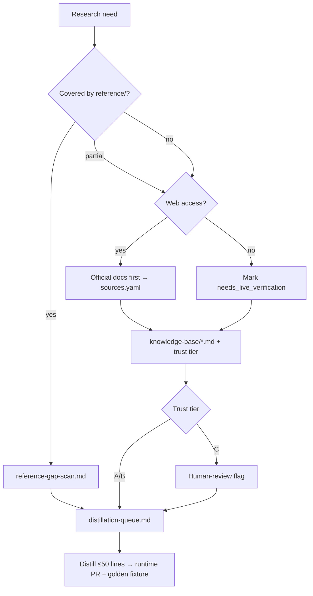

# Research Intelligence Plan

> How to collect, store, and use **internet research**, **AI-assisted research**, and the existing **`reference/`** library to continuously improve the `arabic` runtime skill.

**Status:** Planning (v1.0.0 research layer → v1.1.0 automation)  
**Owner:** Product + content engineering  
**Related:** [Reference Distillation](./reference-distillation.md) · [Command Surface](./command-surface.md)

---

## 1. Goal

Build a **repeatable research pipeline** that turns external knowledge + internal canonical skills into **runtime improvements** — not a pile of bookmarks.

```
Internet + AI research  ──┐
reference/ (38 packs)   ──┼──► research/knowledge-base/ ──► distill ──► arabic/
User feedback + audits    ──┘
```

**Success:** Every research cycle produces at least one **actionable delta** (new rule, vocabulary bank, example, or module patch) with a cited source and acceptance test.

---

## 2. Three Knowledge Layers

| Layer | Location | Role | Lifespan |
|-------|----------|------|----------|
| **Canonical** | `reference/` | Deep specialist skills — source of truth, rarely overwritten | Long |
| **Collected** | `research/` (new) | Raw + curated external intel, snapshots, citations | Medium — refresh on schedule |
| **Runtime** | `arabic/` | What the agent loads during tasks — lean, actionable | Updated each release |

**Rule:** Research never writes directly into `arabic/SKILL.md` without a distillation step and review gate.

---

## 3. Folder Structure (proposed)

```text
research/
├── README.md                    # How to run research cycles
├── index.json                   # Topic registry + last-updated + linked runtime files
├── sources/                     # Citation registry (URL, date, trust tier)
│   └── sources.yaml
├── knowledge-base/              # Curated findings (markdown, one topic per file)
│   ├── dialects/
│   ├── platforms/               # Meta, TikTok, Google Ads, YouTube, etc.
│   ├── seo-aeo/
│   ├── humanization/
│   ├── marketing-psychology/
│   └── seasonal/
├── snapshots/                   # Point-in-time captures (optional, dated)
│   └── YYYY-MM/
├── prompts/                     # Reusable research prompts for Claude / agents (5 canonical)
│   ├── reference-gap-scan.md
│   ├── platform-ads-research.md
│   ├── dialect-freshness-audit.md
│   ├── competitor-landing-teardown.md
│   └── humanization-pattern-mining.md
└── distillation-queue.md        # Pending items → target runtime file
```

Add `research/` to `.gitignore` only for `snapshots/` if they are huge; keep `knowledge-base/` versioned.

---

## 4. Research Types

### A. Internet research (human + agent)

**Use for:** Platform policy changes, ad format specs, hashtag norms, seasonal campaigns, competitor copy patterns, SEO/AEO trends, dialect slang refresh.

| Method | Tool | Output |
|--------|------|--------|
| Targeted web search | Claude / Cursor + search | `knowledge-base/platforms/{platform}.md` |
| Official docs fetch | MCP docs, vendor sites | `sources/sources.yaml` entry + summary |
| Competitor teardown | Manual + agent | `knowledge-base/marketing-psychology/competitor-{name}.md` |
| Seasonal calendar | Preloaded (no live crawl at generation time) | `arabic/references/seasonal-calendar.md` |

**Guardrails (from PRD non-goals):**
- Do **not** claim live trend data during content generation
- Preload seasonal hooks; label research date on every knowledge-base file
- Prefer official sources (Meta Business, Google Ads Help) over blog spam

### B. AI research (structured agent runs)

**Use for:** Synthesizing large `reference/` packs, gap analysis, example generation, audit rubric design.

| Run type | Input | Output |
|----------|-------|--------|
| Reference gap scan | `reference/` + `arabic/references/INDEX.md` | `distillation-queue.md` items |
| Dialect depth pass | `reference/arabic-masri/` vs `arabic/dialects/masri.md` | Patch list + vocabulary deltas |
| QA rubric port | `reference/arabic-qa/` | Audit Mode checklist in runtime |
| Example mining | Golden test failures | `arabic/references/examples.md` additions |
| Command coverage audit | `command-surface.md` vs `SKILL.md` routers | Missing route map |

**Prompt templates:** store in `research/prompts/`; version with date in frontmatter.

### C. Internal reference research (already owned)

**Use for:** Highest-trust linguistic and domain depth.

Priority absorption order (see [reference-distillation.md](./reference-distillation.md)):

1. `arabic-qa` → humanization + Audit Mode  
2. `arabic-content-strategist` → advisory + Project Mode  
3. `arabic-creator` → Pro Mode YAML briefs  
4. `arabic-seo-optimizer` → `seo-aeo-masri.md`  
5. Per-dialect reference packs → `dialects/*.md`

---

## 5. Research Cycle Workflow

Run monthly (or before each minor release):

```
1. PLAN     → Pick 3 topics from distillation-queue + platform changelog check
2. COLLECT  → Internet + AI runs; save to research/knowledge-base/
3. CITE     → Register in research/sources/sources.yaml
4. CURATE   → Editor pass: dedupe, mark trust tier, flag stale items
5. DISTILL  → Map bullets to target runtime file(s); max ~50 lines per PR
6. TEST     → Golden test or audit fixture proves improvement
7. INDEX    → Update research/index.json + arabic/references/INDEX.md
```

### Trust tiers (for citations)

| Tier | Source examples | Use in runtime |
|------|-----------------|----------------|
| **A** | Official platform docs, government, major dictionaries | Direct rules |
| **B** | Established industry blogs, verified practitioners | Examples + notes |
| **C** | Social posts, forums, single anecdotes | Vocabulary hints only — verify |

---

## 6. How Research Improves the Skill (mapping)

| Research topic | Runtime target | User-visible effect |
|----------------|----------------|---------------------|
| Meta Reels specs 2026 | `ads-service-matrix.md` | Correct caption length, CTA placement |
| Masri ad slang refresh | `dialects/masri.md` | Less MSA bleed in ads |
| Khaliji country split | `dialects/khaliji.md` | UAE vs Kuwait tone accuracy |
| Ramadan tone rules | `seasonal-calendar.md` + `taboos.md` | Safer campaign copy |
| AEO answer patterns | `seo-aeo-masri.md` | Better FAQ blocks |
| Humanization anti-patterns | `humanization-protocol.md` | Fewer AI tells |
| TikTok hook structures | `references/engines.md` Captions Engine | Stronger first 3 seconds |
| Book continuity QA | `book-writing.md` | Project Mode chapter consistency |

---

## 7. Claude / Agent Research Prompts (templates)

**Canonical prompt library** — five files in `research/prompts/`, each with dated frontmatter:

| File | Purpose | Primary output |
|------|---------|----------------|
| `reference-gap-scan.md` | Compare a `reference/` pack vs its runtime target; list missing/outdated/safe-to-distill | `distillation-queue.md` items |
| `platform-ads-research.md` | Official ad-format/policy research per platform | `knowledge-base/platforms/{platform}.md` |
| `dialect-freshness-audit.md` | Slang/register drift audit for a dialect | `dialects/{dialect}.md` patch list |
| `competitor-landing-teardown.md` | Teardown of competitor landing/ad copy patterns | `knowledge-base/marketing-psychology/competitor-{name}.md` |
| `humanization-pattern-mining.md` | Mine real native copy for anti-AI texture patterns | `humanization-protocol.md` additions |

### 7.1 Reference vs runtime gap scan

```markdown
Compare `reference/{pack}/` with `arabic/{target}.md`.
List: (1) missing rules, (2) outdated rules, (3) safe-to-distill excerpts (max 30 lines each).
Output to research/distillation-queue.md format. Do not copy entire reference files.
```

### 7.2 Platform ads research

```markdown
Research official {platform} ad formats, character limits, CTA rules, and Arabic market notes.
Cite URLs in sources.yaml. Write curated summary to research/knowledge-base/platforms/{platform}.md.
Propose distill targets in ads-service-matrix.md. No live API claims.
```

### 7.3 Dialect freshness audit

```markdown
Using web search + reference/arabic-{dialect}/, audit arabic/dialects/{dialect}.md for:
slang drift, register levels, false friends, taboo updates. Cite tier A/B sources only.
```

### 7.4 Competitor landing teardown

```markdown
Given {competitor URL or pasted copy}, teardown: hook, value prop, proof, CTA, objection handling,
register, and dialect. Extract reusable PATTERNS (not copy) for Arabic market.
Cite source URL + access date in sources.yaml. Output to
research/knowledge-base/marketing-psychology/competitor-{name}.md. Trust tier B unless official.
```

### 7.5 Humanization pattern mining

```markdown
From {real native Arabic samples / Tier A-B sources}, mine texture patterns: fillers, rhythm,
self-correction, idiom use, scene-based emotion. List anti-AI rules with before/after examples.
Propose ≤30-line additions to humanization-protocol.md. Flag anything Tier C for human review.
```

---

## 7a. Knowledge-base file template

Every `research/knowledge-base/**/*.md` starts with this frontmatter:

```yaml
---
topic: meta-reels-specs            # short slug
last_reviewed: 2026-06-30          # YYYY-MM-DD
trust_tier: A                      # A | B | C
sources:                           # ids referencing sources.yaml
  - meta-business-reels-2026
runtime_targets:                   # files this knowledge distills into
  - arabic/references/ads-service-matrix.md
status: collected                  # collected | curated | distilled | deferred
---
```

## 7b. `sources/sources.yaml` schema

```yaml
sources:
  - id: meta-business-reels-2026   # stable key referenced by KB files
    title: "Meta Reels ad specs"
    url: https://www.facebook.com/business/help/...
    publisher: Meta
    accessed: 2026-06-30
    trust_tier: A                  # A official | B established | C anecdotal
    topics: [platforms, ads]
    runtime_eligible: true         # may inform runtime rules directly (Tier A/B)
```

## 7c. `index.json` schema

```json
{
  "topics": [
    {
      "file": "knowledge-base/platforms/meta.md",
      "topic": "meta-reels-specs",
      "last_reviewed": "2026-06-30",
      "trust_tier": "A",
      "runtime_targets": ["arabic/references/ads-service-matrix.md"],
      "status": "distilled"
    }
  ]
}
```

## 7d. Required web-research behavior

- **Official sources first.** For platform specs and policy-sensitive topics, collect from official docs before drawing conclusions — Meta Business, Google Ads Help, TikTok, Snapchat, LinkedIn, YouTube help centers.
- **Always record** source URL, access date, trust tier, and `runtime_eligible` in `sources.yaml`.
- **Offline / no web access:** mark every unverified source-dependent item `needs_live_verification` and do **not** promote it to a runtime rule.
- **No live-data claims** in generated content — research informs preloaded runtime knowledge only (PRD non-goal).
- **Tier gating:** Tier A/B may inform runtime directly; **Tier C requires a human-review flag** before entering `dialects/` or any runtime file.

## 7e. How `reference/` + internet research combine



---

## 8. Integration with Commands

| Command | Research role |
|---------|----------------|
| `/arabic research <topic>` | Starts a structured research run; writes to `research/knowledge-base/` |
| `/arabic research distill` | Processes `distillation-queue.md` into runtime PR plan |
| `/arabic research status` | Shows index.json + stale sources |

See [Command Surface](./command-surface.md).

---

## 9. Phasing

| Phase | When | Deliverables |
|-------|------|----------------|
| **R0** | v1.0.0 prep | `research/README.md`, `sources.yaml`, `distillation-queue.md`, 3 prompt templates |
| **R1** | v1.0.0 | First distillation from reference Phase A–B complete |
| **R2** | v1.0.0 | `knowledge-base/platforms/` for Meta, Google, TikTok |
| **R3** | v1.1.0 | Monthly research cron doc + `/arabic research` command wired |
| **R4** | v1.2.0 | Automated stale-source checker in `scripts/validate-research.sh` |

---

## 10. Acceptance Criteria

- [ ] `research/index.json` lists every knowledge-base file and its runtime target
- [ ] Every knowledge-base doc has `last_reviewed`, `trust_tier`, and `sources[]`
- [ ] Distillation queue never exceeds 20 open items (finish or defer)
- [ ] No runtime file cites research without a corresponding distillation PR
- [ ] Golden tests cover at least one research-sourced ads and one seasonal example

---

## 10a. Git workflow

Phase IDs (R0–R4) are cross-cutting tracks in the [canonical phase map](./implementation-plan.md#0-canonical-phase-map--golden-tests-source-of-truth).

- **Branch:** `feat/research-r0-scaffold` (then `feat/research-r1-distill`, etc.)
- **Commits:** separate the scaffold (`feat(research): R0 — knowledge layer scaffold`) from distillation PRs that touch runtime
- **PR checklist:**
  - [ ] `research/` files have valid frontmatter (`topic`, `last_reviewed`, `trust_tier`, `sources[]`, `runtime_targets[]`)
  - [ ] Every new KB doc has a `sources.yaml` entry with access date + trust tier
  - [ ] No runtime file cites research without a paired distillation PR
  - [ ] `index.json` updated
  - [ ] Distillation queue ≤ 20 open items
- **Default:** `research/` lives **in-repo** (versioned); only large `snapshots/` may be gitignored.

## 11. Open Questions for Claude Audit

1. Should `research/` live in-repo or a separate `arabic-skill-research` repo?
2. Which platforms get Tier-1 research first (Meta + TikTok vs Google + YouTube)?
3. How much Arabic vs English in `knowledge-base/` notes?
4. Who approves Tier C slang before it enters `dialects/`?

---

## Related Documents

- [Reference Distillation](./reference-distillation.md)
- [Implementation Plan](./implementation-plan.md)
- [Command Surface](./command-surface.md)
- [Claude Plan Audit Prompt](./claude-plan-audit-prompt.md)
